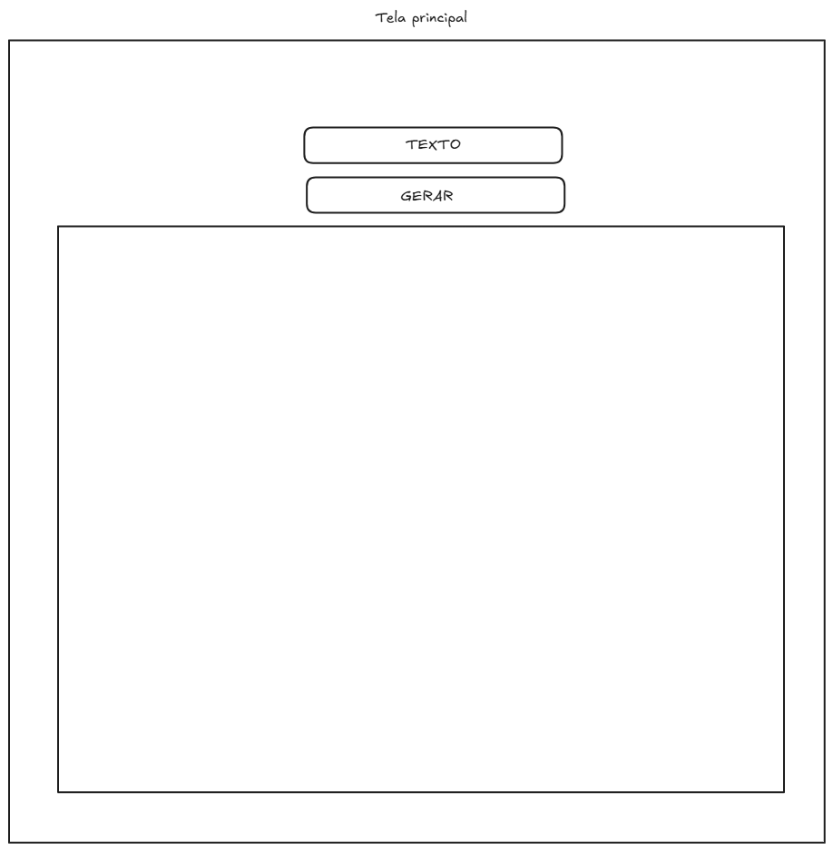

# 🐱 Cat Generator App
Isso não é um projeto de estudo meu é uma proposta para você desenvolvedor use ele como base para os deseafios.

Este projeto é uma aplicação web desenvolvida em **React** para fins de estudo, focada no consumo de APIs REST e manipulação de estados. A aplicação permite que o usuário gere imagens personalizadas de gatos com frases customizadas.

---

## 🎯 Desafio do Projeto

O objetivo principal é integrar a API [CATAAS (Cats as a Service)](https://cataas.com/), utilizando o endpoint de geração de texto dinâmico:

`https://cataas.com/cat/says/:text`

A aplicação deve capturar a entrada do usuário e injetá-la na URL para buscar e exibir a imagem correspondente.

---

## 👤 História de Usuário (User Story)

| Papel | Desejo | Finalidade |
| :--- | :--- | :--- |
| **Usuário Comum** | Gerar uma imagem de gato com um texto personalizado | Visualizar um meme ou imagem aleatória com a frase que digitei |

**Critérios de Aceite:**
1. O usuário preenche um campo de texto.
2. O usuário clica no botão "Gerar".
3. Uma imagem de gato aparece na tela com o texto sobreposto.

---

## 🛠️ Requisitos Técnicos

Para o desenvolvimento deste projeto, são aplicados os seguintes conceitos:

* **Lógica de Programação:** Tratamento de strings e fluxos de dados.
* **Consumo de API:** Requisições assíncronas e manipulação de URIs.
* **Fundamentos Web:** Estruturação em HTML e estilização via CSS.

### 📚 Bibliotecas e Ferramentas
* **React JS:** Biblioteca principal.
* **Axios:** Para interação com a API e gerenciamento de requisições.
* **React Hooks e/ou useState:** Para controle do formulário, armazenamento da URL da imagem e estados de interface.

---

## 🚀 Funcionalidades Adicionais (Extras)

Para melhorar a experiência do usuário (UX), o projeto inclui:
- [ ] **Feedback de Carregamento:** Exibição de um *spinner* ou mensagem de loading durante a requisição.
- [ ] **Tratamento de Erros:** Mensagem visual caso ocorra falha na conexão ou na busca da imagem.
- [ ] **Interface Responsiva:** Design que se adapta a dispositivos móveis.
- [ ] **Imaginação** consumindo a API crie algo você mesmo, com base no seu conhecimento e imaginação
---

## 🔗 Links Úteis
* **Documentação
